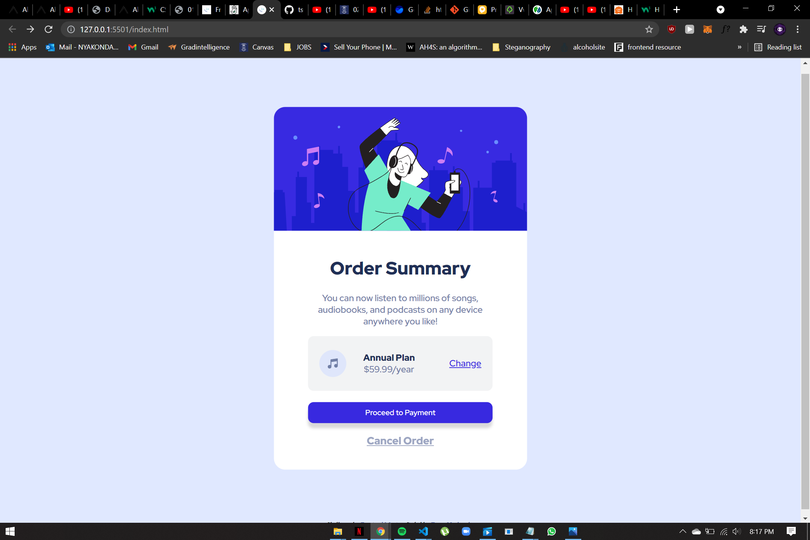

# Frontend Mentor - Order summary card solution

This is a solution to the [Order summary card challenge on Frontend Mentor](https://www.frontendmentor.io/challenges/order-summary-component-QlPmajDUj). Frontend Mentor challenges help you improve your coding skills by building realistic projects. 

## Table of contents

- [Overview](#overview)
  - [The challenge](#the-challenge)
  - [Screenshot](#screenshot)
  - [Built with](#built-with)
  - [What I learned](#what-i-learned)

  - [Useful resources](#useful-resources)
-

## Overview

### The challenge

Users should be able to:

- See hover states for interactive elements

### Screenshot



Add a screenshot of your solution. The easiest way to do this is to use Firefox to view your project, right-click the page and select "Take a Screenshot". You can choose either a full-height screenshot or a cropped one based on how long the page is. If it's very long, it might be best to crop it.

Alternatively, you can use a tool like [FireShot](https://getfireshot.com/) to take the screenshot. FireShot has a free option, so you don't need to purchase it. 

Then crop/optimize/edit your image however you like, add it to your project, and update the file path in the image above.


### Links

## My process

### Built with

- Semantic HTML5 markup
- CSS custom properties
- Flexbox
- CSS Flex


**Note: These are just examples. Delete this note and replace the list above with your own choices**

### What I learned

Use this section to recap over some of your major learnings while working through this project. Writing these out and providing code samples of areas you want to highlight is a great way to reinforce your own knowledge.

To see how you can add code snippets, see below:

```CSS - Easiest way to centre elements
- Use transform translate!
- parent container has to be position relative!
```css
    justify-content: center;
    align-items: center;
    position: absolute;
    top: 50%;
    left: 50%;
    transform: translate(-50%);

### Useful resources

https://www.w3schools.com/howto/howto_css_center-vertical.asp
